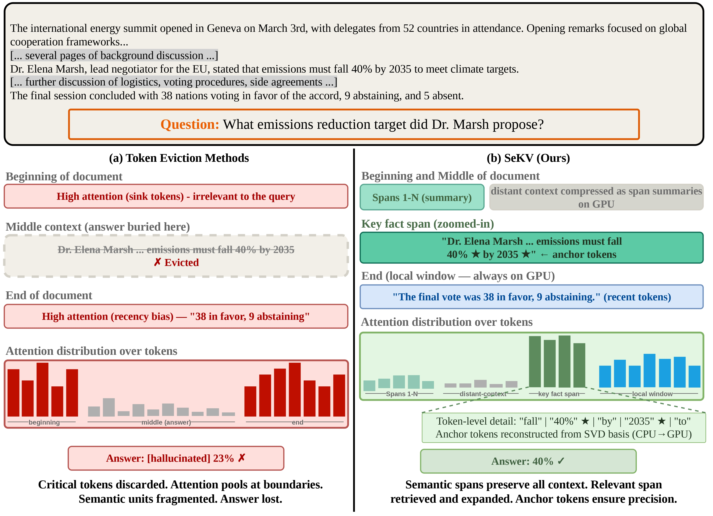
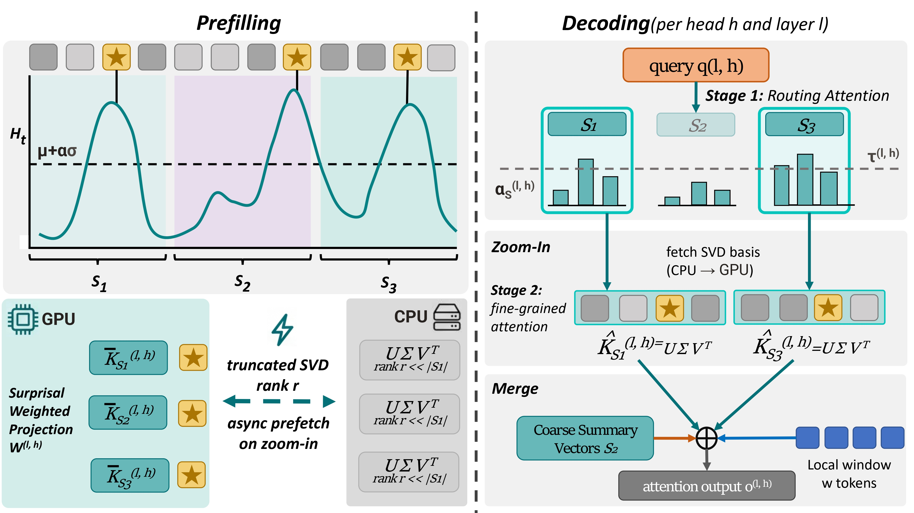

<div align="center">
  <h1>
    SeKV: Resolution-Adaptive KV Cache with Hierarchical Semantic Memory for Long-Context LLM Inference
  </h1>

  <p>
    <a href="https://arxiv.org/abs/2606.31145">
    
    </a>
    
    
    
    
  </p>
</div>

Hierarchical semantic KV-cache compression with entropy-guided spans, learned low-rank SVD bases, and a trained zoom-in mechanism.

This work was done in collaboration with [The University of British Columbia](https://www.ubc.ca/) and [Microsoft Research Asia Vancouver](https://www.microsoft.com/en-us/research/group/microsoft-research-asia-vancouver/).

<p align="center">
  
</p>

## Overview

Long-context generation is often memory-bound, and common token-eviction strategies can permanently drop information that looks unimportant locally but becomes crucial later. In practice, attention also tends to pool near sequence boundaries, so buried evidence can be disproportionately at risk when eviction is irreversible.

SeKV addresses this by segmenting prefill context into semantic spans and storing it at two resolutions: a compact summary that stays GPU-resident and a low-rank SVD basis kept on CPU for reconstruction. Instead of hard-dropping tokens, SeKV preserves a recoverable representation for each compressed span.

At decode time, SeKV routes per layer and per head-group to decide which spans deserve zoom-in. When selected, it reconstructs token-level detail on demand and performs one mixed-resolution attention softmax, so compressed and reconstructed entries compete in a single normalized distribution.

## Method

<p align="center">
  
</p>

SeKV combines four core pieces:

1. Entropy-guided span segmentation: token surprisal is computed and boundaries are set using a threshold of $\mu + \alpha\sigma$, with short anchor prefixes kept in full resolution.
2. Dual-resolution memory: each span stores a GPU summary and, for non-anchor spans, a CPU low-rank SVD basis with a learnable effective-rank budget.
3. Trained zoom-in routing: per-head/layer routing scores, learnable thresholds, and straight-through estimation (STE) are used to train discrete zoom decisions.
4. Mixed-resolution single-softmax attention: anchors, summaries, full-res spans, and reconstructed tokens are concatenated into one attention set and normalized once.

## Supported Models

| Key | HF id | L | H | H_kv | d_h |
|---|---|---:|---:|---:|---:|
| `llama-3.2-3b` | [meta-llama/Llama-3.2-3B-Instruct](https://huggingface.co/meta-llama/Llama-3.2-3B-Instruct) | 28 | 24 | 8 | 128 |
| `llama-3-8b-base` | [meta-llama/Meta-Llama-3-8B](https://huggingface.co/meta-llama/Meta-Llama-3-8B) | 32 | 32 | 8 | 128 |
| `llama-3.1-8b` | [meta-llama/Llama-3.1-8B-Instruct](https://huggingface.co/meta-llama/Llama-3.1-8B-Instruct) | 32 | 32 | 8 | 128 |
| `mistral-7b` | [mistralai/Mistral-7B-Instruct-v0.2](https://huggingface.co/mistralai/Mistral-7B-Instruct-v0.2) | 32 | 32 | 8 | 128 |
| `qwen2.5-14b` | [Qwen/Qwen2.5-14B-Instruct](https://huggingface.co/Qwen/Qwen2.5-14B-Instruct) | 48 | 40 | 8 | 128 |

Only about 0.05% of parameters are trained (routing projections, thresholds, and rank-gate predictor). The backbone weights remain frozen.

## Repository Structure

```text
SeKV/
├── pyproject.toml                # Package metadata, dependencies, and CLI entry points.
├── scripts/
│   ├── train.sh                  # Training launcher wrapper for sekv-train.
│   └── generate.sh               # Generation launcher wrapper for sekv-generate.
├── misc/
│   ├── teaser.jpg                # Teaser figure used in this README.
│   └── method.jpg                # Method/pipeline figure used in this README.
└── sekv/
    ├── __init__.py               # Top-level package exports.
    ├── config.py                 # Typed config dataclasses + YAML loading/validation.
    ├── backbone.py               # Frozen backbone load, model registry/spec, prefill KV extraction.
    ├── segmentation.py           # Surprisal computation and span partitioning.
    ├── modules.py                # Trainable SeKV modules (routing, thresholds, rank gating).
    ├── memory.py                 # Span-memory build, SVD factor storage, reconstruction helpers.
    ├── attention.py              # Mixed-resolution decode attention and budgeted routing.
    ├── teacher.py                # Teacher targets/signals mined from frozen model attention.
    ├── losses.py                 # Distill/zoom/recon/budget losses and total weighting.
    ├── data.py                   # Streaming RedPajama dataset and curriculum helpers.
    ├── train.py                  # SeKV training loop, optimization, checkpointing, CLI.
    ├── generate.py               # Checkpoint load, runtime decode, async SVD prefetch, CLI.
    ├── arch/
    │   ├── __init__.py           # Adapter exports + factory.
    │   ├── base.py               # Architecture adapter interface for explicit layer substitution.
    │   ├── llama.py              # Llama-family adapter implementation.
    │   ├── mistral.py            # Mistral adapter implementation.
    │   └── qwen2.py              # Qwen2 adapter implementation.
    ├── eval/
    │   ├── __init__.py           # Eval package exports.
    │   ├── registry.py           # Benchmark interface + registry.
    │   ├── metrics.py            # Metric functions and task mappings.
    │   ├── efficiency.py         # KV residency / expansion / memory tracking.
    │   ├── benchmarks.py         # LongBench, RULER, NIAH, InfiniteBench, GSM8K adapters.
    │   └── run_eval.py           # Eval orchestrator CLI across benchmarks and budgets.
    └── configs/
        └── default.yaml          # Default training/generation/eval configuration.
```

## Installation

1. Clone and enter the repository.

```bash
git clone https://github.com/AmirAbaskohi/SeKV
cd SeKV
```

2. Create a Python 3.10+ environment.

```bash
python3 -m venv .venv
source .venv/bin/activate
python -V
```

3. Install SeKV in editable mode.

```bash
pip install -e .
```

4. Authenticate with Hugging Face if you will use gated checkpoints (for example, Llama and Mistral).

```bash
huggingface-cli login
```

Notes:
- The project pins Transformers to `>=4.44,<4.58` in `pyproject.toml`.
- Practical training budget (from the project paper context): one model run is typically on the order of about 2-6 hours on a single 8xA100 (80GB) node, with Qwen2.5-14B near the upper end.

## Configuration

All core knobs live in `sekv/configs/default.yaml`. The file defines model loading, segmentation, memory/routing modules, losses, training schedule, and output paths.

```yaml
model:
  name: llama-3.2-3b
  dtype: bfloat16
  device_map: auto

segmentation:
  alpha: 1.0
  l_min: 4

memory:
  r_max: 32
  summary_dim: 32

routing:
  tau_init: 0.05
  ste_temperature: 0.1

loss:
  lambda_zoom: 1.0
  lambda_recon: 0.5
  lambda_budget: 0.1
  beta: 0.1

train:
  lr: 1.0e-3
  max_steps: 3000
  batch_size: 8
  curriculum: [8192, 16384, 32768]

paths:
  output_dir: outputs
  checkpoint_dir: checkpoints
```

You can override key options from CLI (for example model choice):

```bash
sekv-train --config sekv/configs/default.yaml --model llama-3.1-8b
```

## Training

Use the training wrapper script:

```bash
bash scripts/train.sh            # uses defaults
MODEL=qwen2.5-14b bash scripts/train.sh
```

What it does:
- Calls `sekv-train` with the selected config/model.
- Uses curriculum sequence lengths `8192 -> 16384 -> 32768` during training.
- Saves checkpoints to `paths.checkpoint_dir` (default: `checkpoints`).
- Prints periodic logs including total loss and components (`distill`, `zoom`, `recon`, `budget`), plus `mean_effective_rank` and `mean_expansion_rate`.

You can also pass explicit flags to the script:

```bash
bash scripts/train.sh --config sekv/configs/default.yaml --model llama-3.1-8b
```

## Generation / Using a Trained Model

Use the generation wrapper with a prompt and checkpoint:

```bash
bash scripts/generate.sh --prompt "Summarize the following ..." \
  --checkpoint checkpoints/llama-3.1-8b/final.pt --budget 1024 --max-new-tokens 256
```

Behavior notes:
- `--budget` is the peak GPU-resident KV-token cap used by routing. Smaller budgets permit fewer span expansions.
- Decoding is greedy (`temperature = 0` behavior via argmax).
- Instruct checkpoints apply chat templating automatically; base checkpoints (for example `llama-3-8b-base`) do not.

## How It Works at Runtime

Each request flows through these stages:

1. Prefill: run the frozen backbone over prompt tokens and collect per-layer KV caches.
2. Surprisal segmentation: split the prompt into semantic spans with anchor retention.
3. Dual-resolution memory build: keep summaries on GPU and low-rank factors on CPU.
4. Per-step routing: score compressed spans per layer/head-group against the current query.
5. STE zoom decision: select spans for reconstruction under thresholds and optional budget.
6. Async SVD prefetch: stage selected span factors from CPU to GPU in advance.
7. Mixed-resolution single softmax: attend jointly over anchors, summaries, full-res spans, and reconstructed tokens to produce next-token logits.

## Citation
```
@misc{abaskohi2026sekvresolutionadaptivekvcache,
      title={SeKV: Resolution-Adaptive KV Cache with Hierarchical Semantic Memory for Long-Context LLM Inference}, 
      author={Amirhossein Abaskohi and Giuseppe Carenini and Peter West and Yuhang He},
      year={2026},
      eprint={2606.31145},
      archivePrefix={arXiv},
      primaryClass={cs.CL},
      url={https://arxiv.org/abs/2606.31145}, 
}
```

## License

Released under the [MIT License](LICENSE).
